# Тестування працездатності системи

## Запуск Сервера

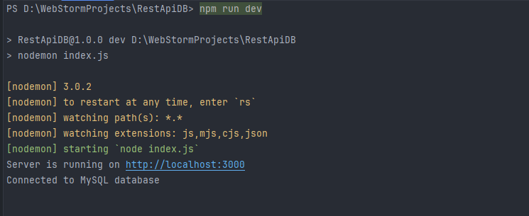

## Тестування для користувача

### GET /users

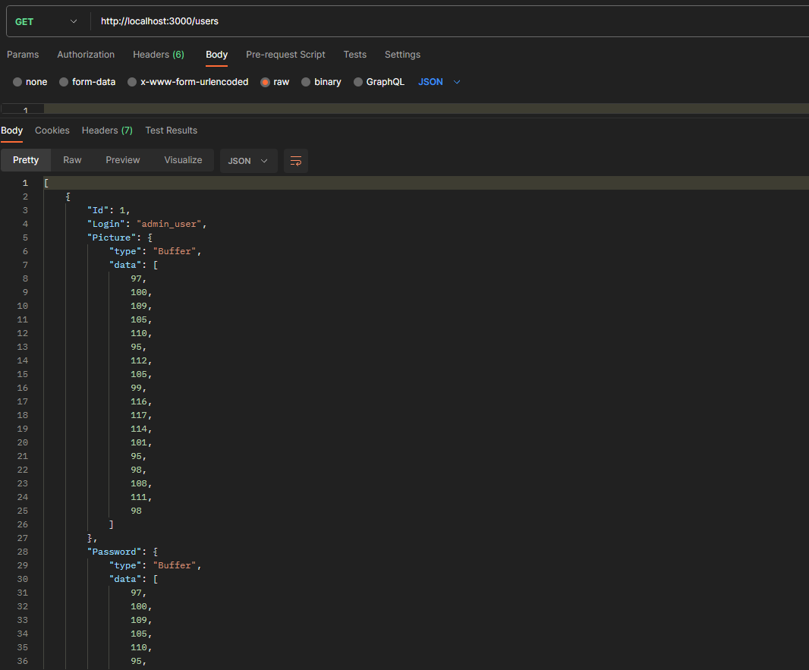

### GET /users/:id

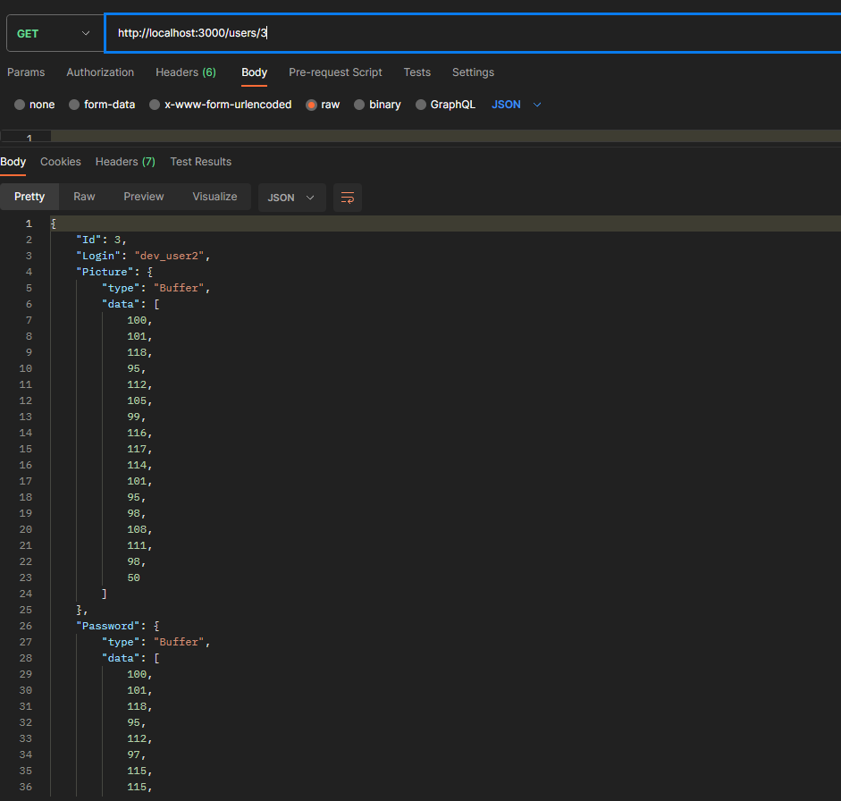

### POST /users

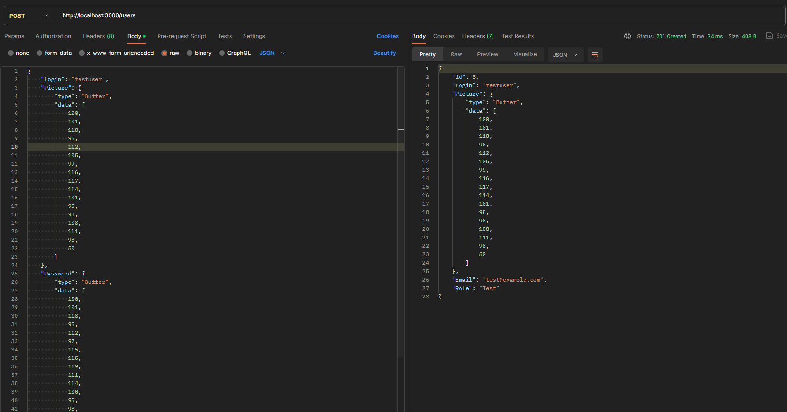

### PUT /users/:id

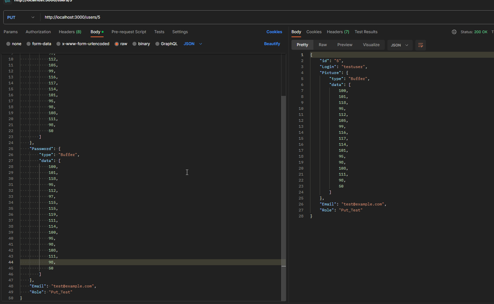

### DELETE /users/:id

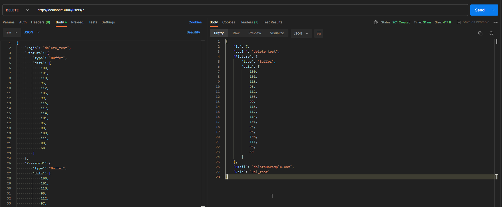
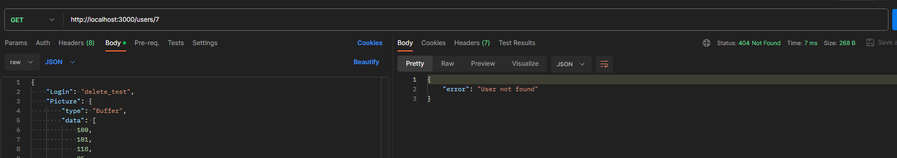

## Тестування для проєктів

### GET /projects

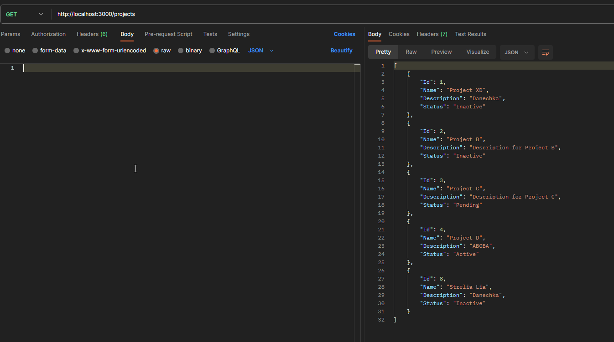

### GET /projects/:id

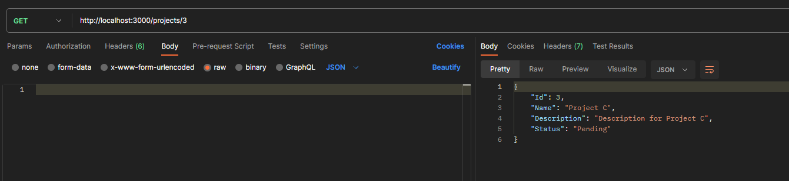

### POST /projects

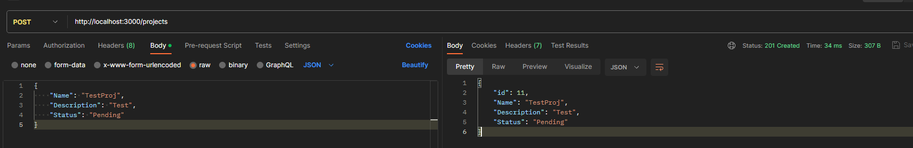

### PUT /projects/:id

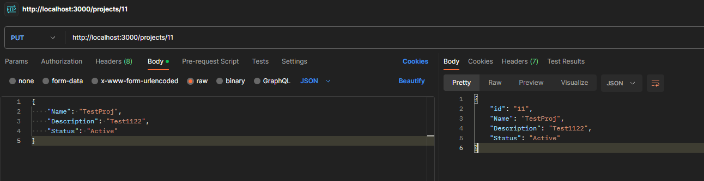

### DELETE /projects/:id

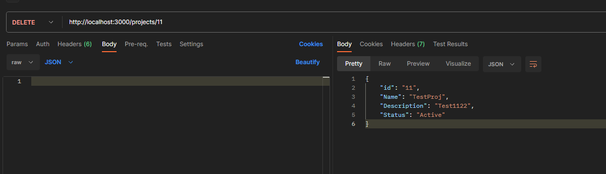
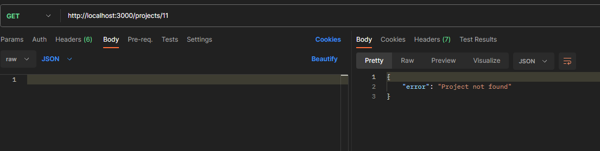

## Тестування для оплати

### GET /payments

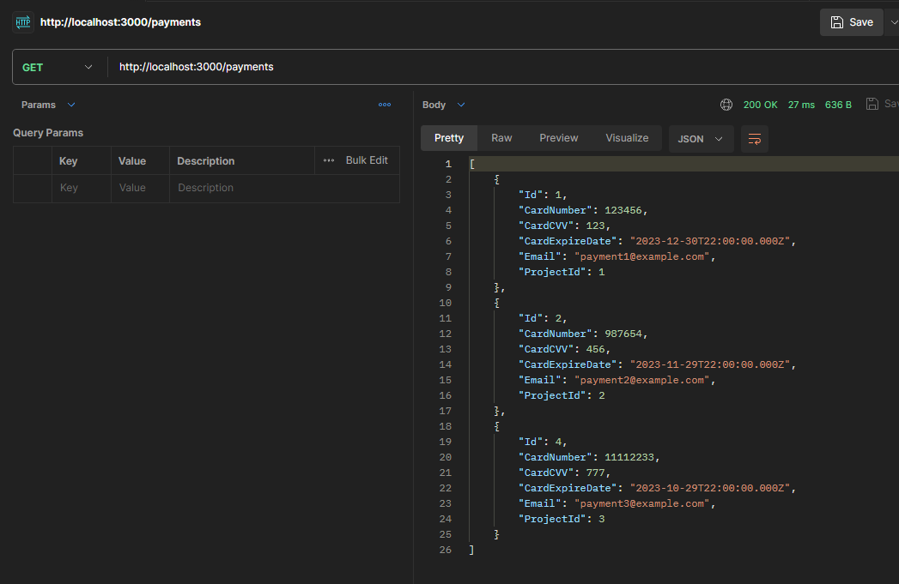

### GET /payments/:id

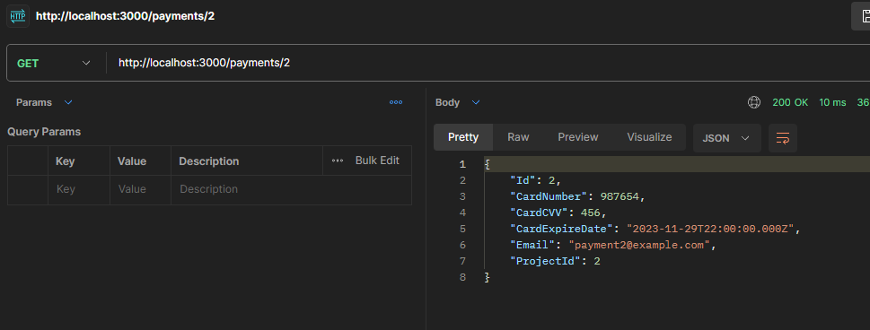

### POST /payments

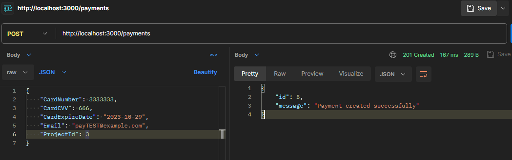

### PUT /payments/:id

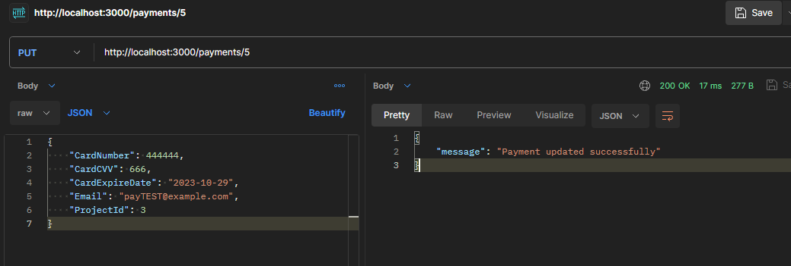

### DELETE /payments/:id

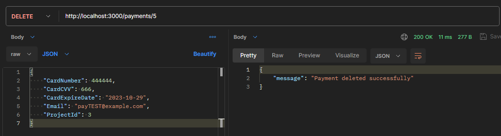
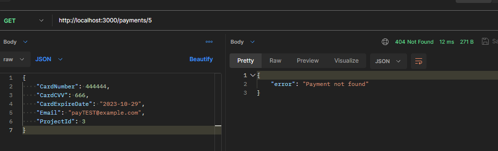
